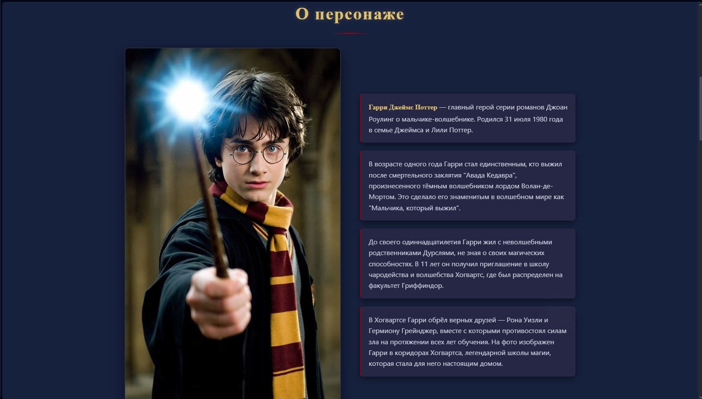
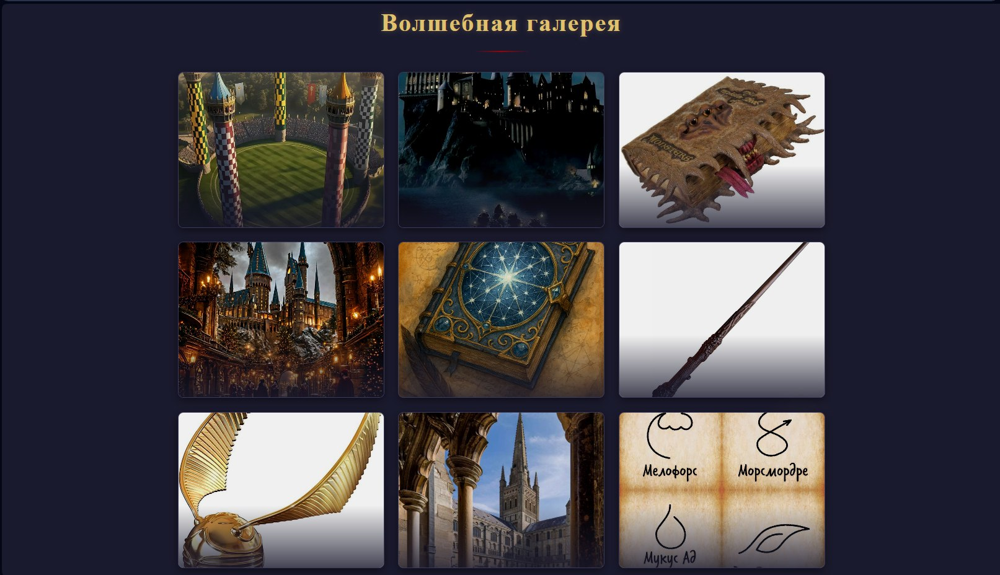
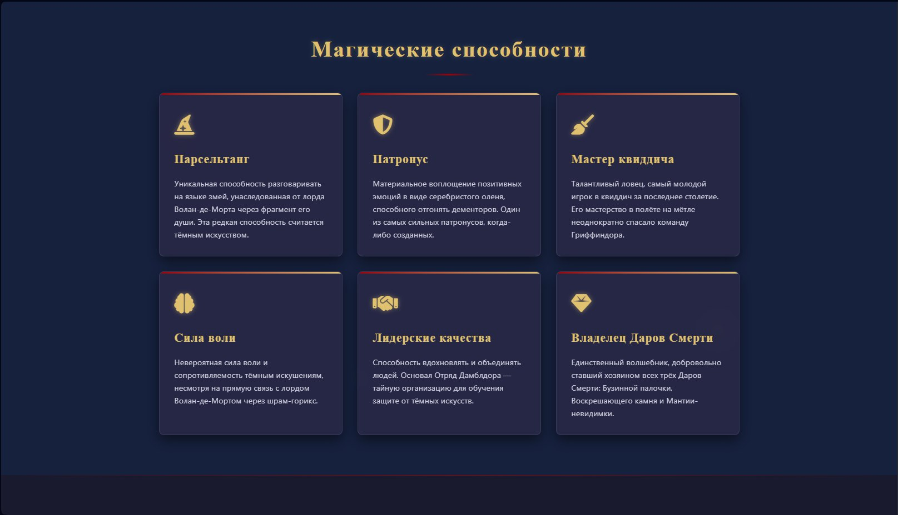

#🧙‍♂️ Сайт-визитка Гарри Поттера

Сайт-визитка для Гарри Поттера, созданная в рамках учебной практики. Адаптивный дизайн, интерактивные элементы, форма обратной связи.

## 📸 Скриншоты

### 🖥️ Десктоп версия сайта
 
                   Вкладка "Домашняя страница"

                      Вкладка "О персонаже"

                  Вкладка "Волшебная галлерея"

                Вкладка "Магические способности"

                    Вкладка "Обратная связь"
                    
## 🚀 Живая демо
https://raisa23127.github.io/Garry_Potter-/

## 🛠 Технологии
- HTML5
- CSS3
- JavaScript
- Git & GitHub

## ✨ Функциональность
- Адаптивный дизайн
- Интерактивная галерея
- Форма обратной связи
- Плавные анимации

## ⚙️ Установка и запуск локально
1. Клонируйте репозиторий:
```bash
git clone https://github.com/Raisa23127/Garry_Potter.git
